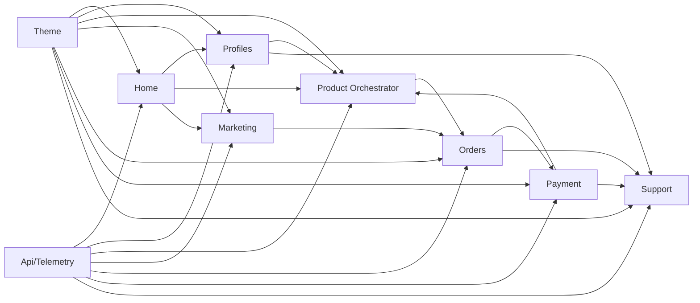

# Documento Maestro 0: El Plano de Ingeniería (Infraestructura)

**Core:** Django 5.1+ | PostgreSQL 16 (Esquemas) | Redis 7.2 | Docker Compose.
**Regla de Oro:** **Degradación Graciosa.** Si la App *X* no está, la App *Y* debe seguir funcionando con un valor neutro.

### 1. Arquitectura de Datos e Identidad

* **Esquema `public`:** Apps 1-9 y Usuarios Globales.
* **Esquemas `tenant`:** Datos operativos del **Product Core**.
* **Aislamiento:** Prohibido importar modelos entre aplicaciones. Comunicación exclusiva vía `services.py`.

### 2. Protocolo de Independencia de UI

* Cada app (3-9) debe poseer una carpeta `templates/[app]/fallback/`.
* Si la App 1 (Theme) no está instalada, la app carga su propio `fallback_layout.html` (HTML puro/minimalista).
* Los componentes visuales usan **Django Cotton** y **Alpine.js** con estados internos, no globales.

---

# Nivel 1: Capa de ADN (Cimientos)

## Documento Maestro 1: App Theme (Design System & i18n)

* **Función:** Capa de sobreescritura (Override). Provee la "belleza" y el "lenguaje".
* **Stack:** Tailwind (Tokens vía variables CSS), Django Cotton (Componentes), Alpine.js (Reactividad).
* **i18n:** Glosario en PostgreSQL (JSONB) + Caché en Redis + Fallback a **LibreTranslate** (Sidecar).
* **Resiliencia:** Si falla, las otras apps activan sus layouts de emergencia.

## Documento Maestro 2: App Api / Telemetry (El Sensor de La Central)

* **Función:** Nervio óptico. Único puente hacia **La Central** (Dashboard externo de monitoreo múltiple).
* **Data Points:** Ventas, órdenes, salud de Agentes IA, tickets y métricas de infraestructura.
* **Protocolo:** Envío asíncrono (Push vía Celery) y API de inspección (Pull vía DRF).
* **Resiliencia:** Si La Central no responde, guarda logs localmente (Fail-soft).

---

# Nivel 2: Capa de Contexto e Integración

## Documento Maestro 3: App Profiles (Identidad & Tenancy)

* **Función:** Gestión de usuarios globales y asignación de esquemas (Tenants).
* **Dashboard:** Agregador de lectura de `Orders`, `Payment` y `Support`.
* **Resiliencia:** En modo fallback (sin Theme), muestra un dashboard básico en lista HTML. No depende de Marketing ni Orchestrator para el login.

## Documento Maestro 4: App Product Orchestrator (El Adaptador)

* **Función:** Envuelve el **Product Core** (externo) y lo convierte en producto.
* **Verticals:** Mapeo técnico y configuración de instancias del core.
* **Entitlements:** Valida si el Tenant tiene derecho a usar una función según lo pagado.
* **Resiliencia:** Si el Product Core no responde, bloquea la función con un mensaje "Servicio temporalmente no disponible" sin romper el SaaS.

---

# Nivel 3: Capa Comercial (Transaccional)

## Documento Maestro 5: App Marketing (Estrategia)

* **Función:** Motor de reglas de descuento, cupones y banners promocionales.
* **Lógica:** Calcula precios dinámicos sin tocar la base de datos del Orchestrator.
* **Resiliencia:** Si falla o no está, las apps superiores asumen **Descuento = 0**.

## Documento Maestro 6: App Orders (Intención)

* **Función:** Gestor de carritos y formalización de órdenes (Snapshots).
* **Estados:** Draft -> Pending -> Processing -> Completed.
* **Resiliencia:** Si Marketing no está, procesa la orden al precio base. Usa su propio template de carrito si Theme falla.

## Documento Maestro 7: App Payment (Conversión)

* **Función:** Interfaz con pasarelas (Stripe/PayPal) y gestión de suscripciones.
* **Conciliación:** Procesamiento de Webhooks y generación de recibos.
* **Resiliencia:** Si falla la comunicación, marca el pago como "Revisión Manual". No activa Entitlements sin confirmación.

---

# Nivel 4: Capa de Relación y Superficie

## Documento Maestro 8: App Support (Asistencia e IA)

* **Función:** Soporte híbrido (Humano + Agente IA con RAG).
* **Knowledge Base:** Documentación dinámica servida por componentes Cotton.
* **Resiliencia:** Si la IA falla, el sistema degrada a un formulario de ticket tradicional.

## Documento Maestro 9: App Home (Fachada Pública)

* **Función:** Vitrina comercial y SEO. Orquestador de consumo total.
* **SEO:** Metadatos dinámicos y Sitemaps.
* **Resiliencia:** Si falta alguna app (ej. Marketing), la Home simplemente oculta los banners de oferta y muestra el catálogo estándar.

---

### Apéndice: Manual de Supervivencia para la IA (System Prompt)

Cada vez que pidas a una IA programar algo, asegúrate de que use este estándar:

1. **Lógica:** Todo en `services.py`. Prohibido importar modelos de otra app.
2. **UI:** Usa `c-components` de Cotton. Implementa `fallback_layout.html`.
3. **Dependencia:** Si necesitas la App *X*, usa `if apps.is_installed('X'):`. Si no está, devuelve un valor neutro (`0`, `False`, `[]`).

---

## Política Global de Independencia de Apps

### Principios Obligatorios
- Acoplamiento suave: una app puede consumir capacidades de otra solo por contratos de servicio.
- Sin importación directa de modelos entre apps.
- Toda dependencia externa debe tener fallback funcional.
- Cada app define explícitamente su alcance y su "No Scope".
- Cada app debe operar en modo degradado sin detener el sistema.

### Reglas de Comunicación Inter-App
- **Escritura:** exclusivamente por `services.py` de la app dueña.
- **Lectura:** exclusivamente por `selectors.py` de la app dueña.
- **Verificación de disponibilidad:** `apps.is_installed('nombre_app')` antes de usar una dependencia suave.
- **Valores neutros por defecto** cuando la dependencia no está:
  - Precio/descuento: `Decimal('0.00')`
  - Acceso/permiso: `False`
  - Colecciones: `[]`
  - Texto traducido: key original

### Límites de Responsabilidad por App
| App | Scope | No Scope |
|---|---|---|
| 1 Theme | Design system, tokens CSS, componentes atómicos Cotton, i18n | Cobros, órdenes, entitlements |
| 2 Api/Telemetry | Trazabilidad, métricas, push/pull con La Central | Lógica comercial y de checkout |
| 3 Profiles | Identidad, tenancy, membresías, RBAC | Pricing, pagos y descuentos |
| 4 Product Orchestrator | Catálogo funcional, adaptadores al core, entitlements | Procesamiento de pago |
| 5 Marketing | Reglas de promociones y cupones | Persistencia financiera |
| 6 Orders | Carrito, snapshots, ciclo de vida de orden | Ejecución financiera real |
| 7 Payment | Pasarelas, webhooks, conciliación, suscripciones | Ownership de catálogo de producto |
| 8 Support | Tickets, asistencia IA, retención | Autorización de acceso al producto |
| 9 Home | Fachada pública, SEO, agregación de presentación | Reglas de negocio transaccionales |

### Checklist de Cumplimiento de Independencia
- [ ] No hay importaciones de modelos cruzados entre apps.
- [ ] Todas las llamadas cross-app pasan por service/selectors.
- [ ] Cada app define Scope y No Scope.
- [ ] Existe fallback para cada dependencia suave.
- [ ] Existen pruebas de degradación por app.

---

## Mapa de Interacciones de Alto Nivel

### Flujo Macro de Valor
Captación → Perfil/Tenancy → Catálogo → Precio → Orden → Pago → Activación → Soporte → Telemetría.

### Escenarios de Degradación Esperados
- **Sin Marketing:** Orders opera con precio base; Home oculta banners de oferta.
- **Sin Theme:** cada app usa su propio `fallback_layout.html`.
- **Sin Telemetry:** se almacenan logs locales; el flujo principal no se bloquea.
- **Sin Support IA:** se habilita ticket humano estándar.

---

## Glosario Conceptual de Entidades de Negocio

| Entidad | Definición Conceptual | App Dueña |
|---|---|---|
| User | Identidad global del operador del SaaS | Profiles |
| Tenant | Organización/empresa aislada por esquema PostgreSQL | Profiles |
| Membership | Relación User-Tenant con rol asignado | Profiles |
| Profile | Preferencias del usuario dentro del tenant | Profiles |
| Product | Oferta comercial visible al cliente | Product Orchestrator |
| Vertical | Capacidad técnica específica del Product Core | Product Orchestrator |
| Entitlement | Derecho de uso por tenant y periodo activo | Product Orchestrator |
| DiscountRule | Regla automática de descuento (porcentaje/monto) | Marketing |
| Coupon | Código promocional con restricciones de uso | Marketing |
| Campaign | Agrupación de reglas y cupones bajo un concepto | Marketing |
| Cart | Intención de compra editable | Orders |
| Order | Snapshot inmutable de compra | Orders |
| OrderItem | Línea de producto dentro de la orden | Orders |
| PaymentIntent | Intento de cobro vinculado a una orden | Payment |
| Subscription | Relación de cobro recurrente (tenant + plan) | Payment |
| Invoice | Registro de cobro emitido | Payment |
| Ticket | Caso de soporte del cliente | Support |
| KnowledgeArticle | Entrada de base de conocimiento para RAG | Support |
| Lead | Prospecto captado en Home antes de ser usuario | Home |
| TelemetryEvent | Evento operativo/comercial de observabilidad | Api/Telemetry |

### Términos Operativos del Ecosistema
- **Soft-dependency:** relación opcional entre apps, siempre con fallback definido.
- **Fallback:** comportamiento seguro y explícito cuando una dependencia está ausente.
- **Snapshot:** copia inmutable de datos transaccionales al confirmar una orden.
- **Tenant Isolation:** separación estricta de datos por esquema PostgreSQL.

---

## Riesgos Conceptuales del Ecosistema (Fase 0)

| ID | Riesgo | Tipo | Impacto | Probabilidad | Mitigación Conceptual |
|---|---|---|---|---|---|
| R-01 | Acoplamiento accidental entre apps | Técnico | Alto | Media | Política de independencia + service/selector |
| R-02 | Fallo de dependencia clave sin fallback | Técnico | Alto | Media | Política obligatoria de degradación |
| R-03 | Ambigüedad de ownership de entidades | Organizacional | Alto | Alta | Glosario con app dueña única |
| R-04 | Inconsistencia de decisiones entre docs | Proceso | Medio | Alta | Anchor docs + checklist de trazabilidad |
| R-05 | Fuga de datos entre tenants | Seguridad | Alto | Media | Aislamiento por esquema + router/middleware |
| R-06 | Sobrecarga de complejidad temprana | Delivery | Medio | Alta | Entregas por fase Scrum y app boundaries |
| R-07 | Dependencia excesiva de proveedor de pago | Negocio | Medio | Media | Provider pattern multicasarela |
| R-08 | Alucinaciones/errores en soporte IA | Producto | Medio | Media | RAG + escalamiento obligatorio a humano |

